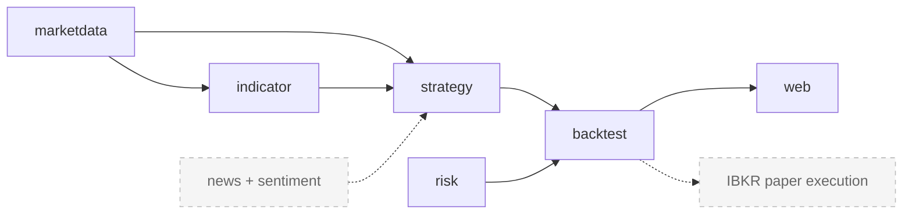

# QuantDesk

[](https://github.com/OWNER/quantdesk/actions/workflows/ci.yml)

QuantDesk is a quant backtesting engine that tests trading strategies on historical price data. Feed it a price series, plug in a strategy, and get back a clean set of performance metrics — total return, drawdown, risk-adjusted returns, and trade statistics — over a simple REST API. It runs fully offline against bundled sample data, so there is nothing to configure and no external services to reach.

## Module flow



Solid arrows are the modules that exist today. Dashed nodes (`news + sentiment`, `IBKR paper execution`) are planned — see the roadmap below.

## Features

- **Pluggable `Strategy` interface** — drop in a new strategy by implementing a single-method contract; the engine does not care how the signal is produced.
- **Built-in strategies** — SMA crossover, RSI, Momentum, and Buy-and-Hold.
- **Performance metrics** — total return, maximum drawdown, Sharpe ratio, Sortino ratio, and CAGR, plus trade count and win rate.
- **Sample data included** — a bundled `SAMPLE` price series so the engine runs out of the box with no data setup.
- **REST API** — run a backtest and read the metrics as JSON via a single HTTP endpoint.

## Tech stack

| Component     | Version         |
|---------------|-----------------|
| Java          | 21              |
| Spring Boot   | 3.3             |
| Build tool    | Maven           |

## Run locally

```bash
mvn spring-boot:run
```

Then run a backtest against the bundled sample series:

```
GET http://localhost:8080/backtest?symbol=SAMPLE&fast=10&slow=30
```

`symbol` selects the price series, and `fast` / `slow` set the SMA crossover periods. The response is a JSON document with the symbol, strategy name, and the computed performance metrics.

## Roadmap

The current release is a self-contained backtesting engine. Planned phases:

1. **Live market data** — pluggable market-data feeds so strategies can run against fresh prices instead of only bundled history.
2. **News sentiment via an LLM** — a `news + sentiment` module that scores headlines with a language model and exposes sentiment as a strategy input.
3. **Interactive Brokers PAPER-trading execution** — route strategy signals to an IBKR **paper** account to validate execution end to end.
4. **Risk limits** — position sizing, exposure caps, and stop rules enforced by the `risk` module.

> **Out of scope for now:** live and real-money trading. The execution roadmap targets **paper trading only** and requires a broker paper account plus a compliance review before any orders — simulated or otherwise — are placed. QuantDesk ships as an offline backtesting tool and does not connect to a broker.
