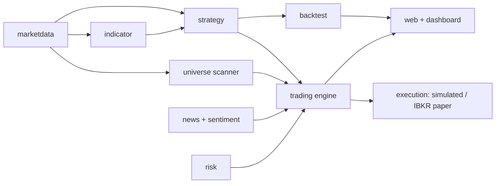

# QuantDesk

[](https://github.com/OWNER/quantdesk/actions/workflows/ci.yml)

QuantDesk is a quant research and paper-trading console built on Spring Boot. It backtests strategies on historical price data, pulls live market data and news sentiment, scans a US large-cap universe for momentum, and routes signals through a risk-checked trading engine — in simulation or against an IBKR **paper** account, never with real money. Backtests and all tests run fully offline against bundled CSV data.

## SAFETY

> **QuantDesk never trades real money.** The only trading modes are `OFF` (default — the engine does nothing), `DRY_RUN` (signals are logged, no orders are placed anywhere), and `PAPER` (orders go to a simulated broker or an IBKR **paper** account). There is no real-money mode in the codebase. Every order — paper or simulated — must first pass the risk manager (position and exposure caps) and the news sentiment veto, and the dashboard kill switch (`POST /trading/kill`) flips the engine to `OFF` instantly. Nothing in this project is investment advice.

## Module flow



The universe scanner ranks the whole universe by momentum and hands the top names to the trading engine, which sizes and risk-checks every order before it reaches the (paper-only) execution layer.

## Features

- **Pluggable `Strategy` interface** — drop in a new strategy by implementing a single-method contract; the engine does not care how the signal is produced.
- **Built-in strategies** — SMA crossover, RSI, Momentum, and Buy-and-Hold.
- **Universe scanner** — cross-sectional momentum ranking over ~100 US large caps, feeding an automatic top-5 rotation portfolio.
- **News sentiment** — headlines are scored and negative sentiment vetoes buys.
- **Performance metrics** — total return, maximum drawdown, Sharpe ratio, Sortino ratio, and CAGR, plus trade count and win rate.
- **Sample data included** — bundled CSV price series so the engine and all tests run offline with no data setup.
- **REST API + dashboard** — backtests, scan results, positions, trade log, and trading controls as JSON and as a single-page dashboard.

## Universe scanner & momentum strategy

The universe lives in `data/universe.csv` — roughly 100 US large caps as a plain CSV that you can edit to change what gets scanned.

Each scan computes **cross-sectional momentum**: every symbol's trailing return over a lookback of **63 trading days** (about three months), ranked best to worst. The trading engine holds the **top 5** and rebalances automatically: it sells positions that drop out of the top 5, buys new entrants, and targets equal weight per position. Every rebalance order still passes the news sentiment veto and the risk caps before execution.

Endpoints:

| Endpoint | Purpose |
|---|---|
| `GET /scan` | Latest ranking (rank, symbol, momentum score, last price, data availability) and `lastScanAt` |
| `POST /scan/run` | Trigger a scan immediately |
| `GET /backtest/portfolio` | Backtest the cross-sectional momentum portfolio on historical data |

**An honest note on momentum.** Cross-sectional momentum is one of the best-documented historical anomalies in equity markets (Jegadeesh & Titman, *Returns to Buying Winners and Selling Losers*, Journal of Finance, 1993). It has also suffered long droughts and violent crashes, and a documented historical edge is exactly that — historical. Past performance guarantees nothing about the future.

Prefer trading a fixed watchlist instead of the scanned universe? Set `quantdesk.trading.universe-mode=false` and the engine trades the configured watchlist as before.

## Tech stack

| Component     | Version         |
|---------------|-----------------|
| Java          | 21              |
| Spring Boot   | 3.3             |
| Build tool    | Maven           |

## Run locally

```bash
mvn spring-boot:run
```

Open the dashboard at `http://localhost:8080/` or run a backtest against the bundled sample series:

```
GET http://localhost:8080/backtest?symbol=SAMPLE&fast=10&slow=30
```

`symbol` selects the price series, and `fast` / `slow` set the SMA crossover periods. The response is a JSON document with the symbol, strategy name, and the computed performance metrics.

## Roadmap

Shipped so far: the backtesting engine, pluggable live market data, LLM news sentiment, risk limits, the universe scanner with automatic momentum rotation, and paper-only execution (simulated broker and IBKR Client Portal paper gateway). Next up: richer portfolio analytics and more data providers.

> **Out of scope, permanently for now: live and real-money trading.** Execution targets **paper trading only** and requires a broker paper account plus a compliance review before any orders — simulated or otherwise — are placed.
